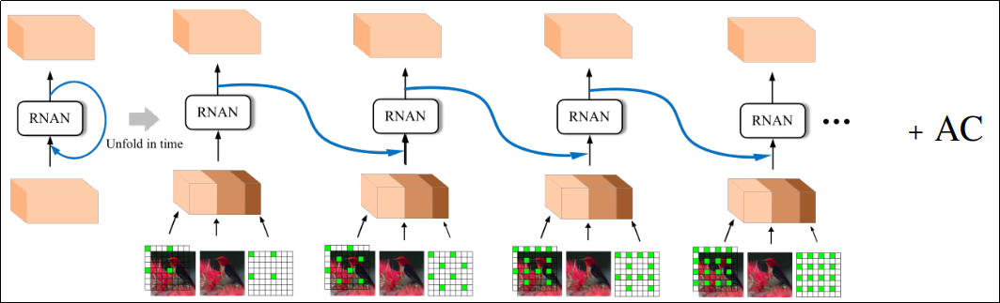
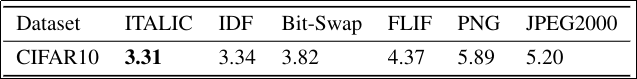

# ITALIC: ITerative and Attentive Lossless Image Compression
Generally, we can categorize density estimators in two group of auto-regressive and non-auto-regressive. Auto-regressive methods predict probability of each pixel conditioned on previous pixels and non-auto-regressive approaches estimate it independently. The former approaches such as [PixelCNN](https://arxiv.org/abs/1606.05328) are powerful density estimators, however, they are slow in decoding phase. On the other hand, for faster decoding time, non-auto-regressive models have lower NLL.  They are popular models like [Multi-scale pixelCNN](https://arxiv.org/abs/1703.03664) lying between mentioned methods but their fixed arhitecture does not allow them to select a specific time/bpp point based on need. In this project, we attempt to alleviate this problem by designing a recursive architecture abling to establish time/bpp trade-off.

## Dependencies

* numpy
* Tensorflow>=1.8
* scipy 

## Dataset

[Cifar32](https://www.cs.toronto.edu/~kriz/cifar.html) - Using aligned images and then 

## Overview

Our approach attempts to recursively estimate the probability of an image conditioned on a low-leve code (in our project, bpg code) and use Arithmetic Coding (AC) for encode\decode procedure. Based on time/bpsp we need, we change the number of recursion (steps) for encoding\decoding an image. Also the number of pixels being encoded\decoded is adjustable. Indeed, we input the network with pre-determined binary mask for each step. Ones in the mask show the pixels being encoded\decoded in that step. So by this technique, we can select our steps from one to image's number of pixels.
Our network's architecture is inspired by [RNAN](https://arxiv.org/abs/1903.10082) method. RNAN restores distorted images with the help of self-attention mechanism. Actually, the non-local attention allows network to get more sensitive to important part of the image. As we estiamte density based on bpg code this, our model can be interpreted as probabilistic image enhancer so RNAN architecture is aligned with ours. Moreover, non-local blocks increase the receptive filed to the size of the image which imporves the predictibility. The architecure of network is shown in Fig.1.

*Fig.1 architecure of the network*

## Results

we evaluate our bpsp (bit per sub-pixel) on Cifar-10 test-set and compare it to the recent lossless image compression methods in Table.1 .

*Table.1 bpsp comaprison*

## Usage:

**For training the model**

* python main.py

**For testing**

* python main.py --op 1

